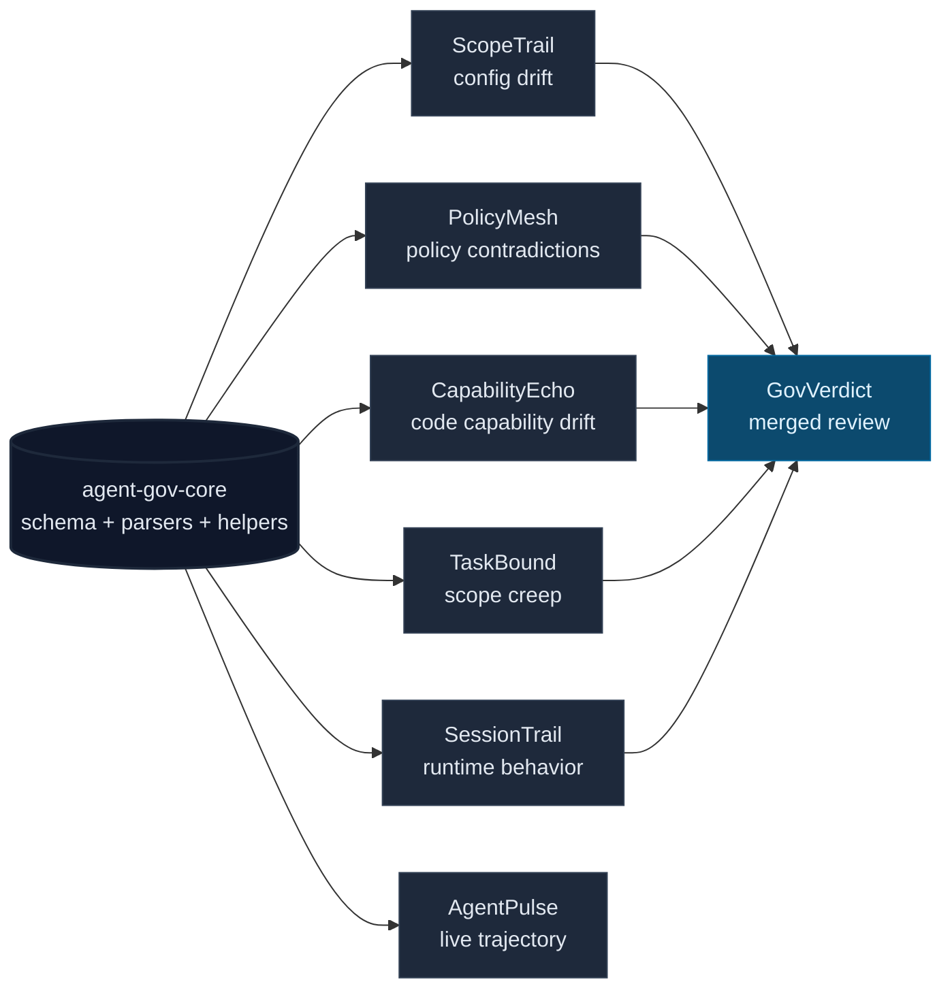

# agent-gov-core

[](https://www.npmjs.com/package/agent-gov-core)
[](LICENSE)

**The shared substrate for the agent-gov suite.** `agent-gov-core` provides the canonical `Finding` schema, report envelope, merge helpers, parsers, locators, exception handling, shell tokenization, and GitHub Action rendering utilities used across the local-only AI-agent governance tools.

ScopeTrail, PolicyMesh, CapabilityEcho, TaskBound, SessionTrail, GovVerdict, and AgentPulse all need the same boring primitives: stable fingerprints, validated JSON reports, config readers, line locators, and severity/rating rules. This package keeps that contract in one place instead of seven.



Zero runtime dependencies. ESM, TypeScript, target ES2022.

## Why this exists

The suite only works if every tool agrees on what a finding is, how severity rolls up, how fingerprints dedupe, how malformed reports surface, and how configs map back to source lines. Without a shared substrate, every detector would grow its own almost-compatible schema and GovVerdict would become glue code for drift between the tools themselves.

`agent-gov-core` exists to make the suite composable. Each tool keeps its domain reasoning; shared contracts live here.

## What it provides

| Surface | What lives here |
| --- | --- |
| **Finding contract** | `Finding`, severities, tool kinds, namespaced kinds, stable fingerprints, validation. |
| **Report contract** | `Report`, `MergedReport`, rating rollup, strict validation, invalid-report accounting. |
| **Merge substrate** | `mergeFindings`, thresholds, duplicate collapse, exception application, workflow metadata. |
| **Config parsing** | JSONC and TOML readers with source text and structured parse errors. |
| **Source location** | JSON/TOML line locators, offset-to-line/column helpers, GitHub annotation formatting. |
| **Detector helpers** | MCP command normalization, shell tokenization, secret matching, workflow summary rendering. |
| **Transcript parsing** | Claude Code / Cursor / Codex / Antigravity session JSONL normalized into one `TranscriptEvent` stream. |
| **Test fixtures** | Temp repo and old/new fixture builders for consumer tool test suites. |

## Install

```sh
npm install agent-gov-core
```

## The canonical Finding

Every tool in the suite emits findings against the same schema. The `kind` field is a namespaced string `<tool>.<slug>` so a downstream meta-reviewer can dedupe across tools.

### Emit a finding

```ts
import { createFinding } from 'agent-gov-core';

const finding = createFinding({
  tool: 'scope_trail',
  name: 'permission_allow_widened',
  severity: 'high',
  message: 'Claude permission allowlist now includes Bash(npm *).',
  location: { file: '.claude/settings.json', line: 12 },
});
// finding.kind === 'scope_trail.permission_allow_widened'
// finding.fingerprint === '<stable 16-char hex>'
```

`createFinding` calls `kind()` to build the namespaced kind, validates the slug shape, and computes a stable `fingerprintFinding(finding)` hash of `(kind, file, line, column, salientKey?)`. Pass `salientKey` when two distinct findings can legitimately fire at the same `(kind, file, line)` site.

### Validate findings from disk

```ts
import { validateFinding } from 'agent-gov-core';
import { readFileSync } from 'node:fs';

const report = JSON.parse(readFileSync('scopetrail-report.json', 'utf8'));
for (const f of report.findings) {
  const result = validateFinding(f);
  if (!result.ok) {
    console.error(`Skipping malformed finding: ${result.errors.join('; ')}`);
    continue;
  }
  // ... merge into cross-tool inbox keyed by f.fingerprint ...
}
```

### Merge reports across tools

A cross-tool reviewer ingests JSON reports from N tools, dedupes findings by fingerprint, applies a severity threshold, and rolls up an aggregate rating. The library ships this as `mergeFindings`:

```ts
import { mergeFindings } from 'agent-gov-core';
import { readFileSync } from 'node:fs';

const reports = [
  JSON.parse(readFileSync('scopetrail-report.json', 'utf8')),
  JSON.parse(readFileSync('policymesh-report.json', 'utf8')),
  JSON.parse(readFileSync('capabilityecho-report.json', 'utf8')),
];

const merged = mergeFindings(reports, { threshold: 'medium' });
console.log(`Merged rating: ${merged.rating}`);
console.log(`${merged.findings.length} unique findings across ${merged.sources.length} tools`);
console.log(`Dropped ${merged.droppedBelowThreshold} below threshold; collapsed ${merged.duplicateCollapsed} duplicates`);
```

Malformed reports go to `merged.invalidReports`; malformed individual findings go to `merged.invalidFindings`. Neither is silently dropped.

### Schema is the contract

The JSON schema at [`schemas/finding.schema.json`](./schemas/finding.schema.json) is the source of truth for dotted-kind shape, closed `tool` enum, and location fields. Any tool emitting unprefixed kinds fails validation. See [CONTRIBUTING.md](./CONTRIBUTING.md#the-finding-schema-is-the-contract) for how the TypeScript types and JSON schema stay in lockstep.

The `tool` enum is deliberately closed to the **five** finding-emitting analyzers — `scope_trail`, `policy_mesh`, `capability_echo`, `task_bound`, `session_trail`. That is fewer than the seven suite repos that depend on this package: GovVerdict *merges* findings via `mergeFindings` rather than emitting its own, and AgentPulse consumes the transcript and `Finding` primitives for live trajectory work. Adding a sixth emitter means updating the `ToolKind` union, `TOOL_KINDS`, and the schema's `tool` enum together — the test suite fails if they drift.

## What's in the library

### Finding schema and helpers

- `Finding`, `Severity`, `ToolKind`, `FindingLocation` — canonical types
- `SEVERITIES`, `TOOL_KINDS` — runtime arrays of enum values
- `isSeverity(v)`, `isToolKind(v)`, `isNamespacedKind(v)` — type guards
- `kind(tool, name)` — build a namespaced kind without hand-assembling the dotted string
- `createFinding({tool, name, severity, message, ...})` — convenience constructor
- `fingerprintFinding(finding)` — stable 16-character hex hash
- `validateFinding(value)` — runtime check against `schemas/finding.schema.json`

### Hardcoded secret detection

- `matchSecret(value, options?)` — scans for provider-prefix credentials and returns `{ provider }`, never the literal credential. Pass `envOrHeaderContext: true` only when scanning env/header values.
- `SECRET_PATTERNS` — read-only constant pinned by golden tests.

### Exception baselines

- `applyExceptions(findings, exceptions, now?)` — suppress findings matched by `kind` plus optional `salientKey` and `pathPrefix`. Expired exceptions re-surface as low-severity `[EXPIRED WHITELIST]` findings.
- `validateException(value)` — runtime check for exception entries loaded from JSON/YAML.

### Report envelope and merge

- `Report` — canonical multi-tool envelope with `schemaVersion`, `tool`, `rating`, findings, refs, optional IDs, and extension `data`
- `REPORT_SCHEMA_VERSION` — current envelope version (`'1.0'`)
- `createReport({tool, findings, ...})` — sets schema version and derives rating
- `maxSeverity(findings)` — returns `'none' | Severity`
- `validateReport(value)` — strict envelope check
- `mergeFindings(reports, opts?)` — combine reports, dedupe, threshold, preserve invalid inputs, and roll up rating
- `validateMergedReport(value)` — strict check for merged output

`Report.conversationId` and `MergedReport.workflowName` cross-walk to OpenTelemetry gen-AI fields; see [`docs/INTEROP-OTEL.md`](./docs/INTEROP-OTEL.md).

### Config readers

- `readJsonObjectWithSource(path)` / `stripJsonComments(text)` — JSONC reader with comment/trailing-comma stripping and source preservation
- `readTomlObject(path)` / `parseToml(text)` — TOML reader for sections, arrays of tables, inline tables, multi-line strings, dotted/quoted keys
- `ConfigParseError` — structured parse errors with line, column, raw offset, and cause
- `lineColumnOfOffset(text, offset)` — convert a 0-based byte offset to `{ line, column }`

### Line locators

- `lineOfJsonKey(text, key, scope?)`
- `lineOfJsonStringValue(text, value, scope?)`
- `lineOfTomlKey(text, dottedKey, scope?)`

### MCP command normalization

- `normalizeMcpCommand({ command, args, url, env, cwd })` — canonical identity string for MCP server entries. Used to reduce false positives when equivalent servers are spelled differently across machines or config files.

### Shell tokenization

- `tokenizeShell(command)` — quote-aware split on `;`, `|`, `&&`, `||` plus trivial obfuscation neutralization
- `tokenizeShellDeep(command)` — extracts commands nested inside `$()`, backticks, and `bash -c` / `sh -c` / `python -c` payloads
- `getCommandHead(subcommand)` — extract the leading verb after tokenization

### Diff-input safety

Guards for the boundary where an untrusted diff (a PR branch, a pair of directories) enters a `git` subprocess or a `readFile`. Promoted out of ScopeTrail and TaskBound so every detector applies the same rules.

- `isValidGitRef(ref)` — reject refs `git` would re-parse as a CLI flag (`-`-leading), as an object selector (`:`), or that carry control characters. Pure string check; callers still run `git rev-parse --verify` to confirm the ref resolves.
- `resolveWithinRoot(root, relativePath)` — resolve a path against `root`, returning the absolute path only if it stays inside `root` (else `null`). Stops `..`/absolute-path traversal before any read. Callers must also skip symlinked directory entries during the walk.
- `withinByteCap(byteLength, cap?)` / `DEFAULT_MAX_INPUT_BYTES` — pure size-cap predicate (default 10 MiB) so detectors can skip oversized inputs. Fails closed on non-finite or negative sizes.

### Transcript parsing

Normalizes Claude Code, Cursor, Codex, and Antigravity session JSONL into one event stream — promoted out of the copies once vendored separately in SessionTrail and AgentPulse so every tool shares one parser surface that can't drift.

- `TranscriptEvent` — the normalized cross-runtime event: `timestamp`, `runtime`, `kind`, plus optional `text` / `toolName` / `toolInput` / `toolResultText` / `toolResultExitCode` / `cwd` / `toolUseId` / `raw`
- `Runtime` (`'claude-code' | 'cursor' | 'codex' | 'antigravity' | 'unknown'`), `EventKind` (`'user_message' | 'assistant_message' | 'tool_use' | 'tool_result' | 'system'`), `ParseOptions` (`since` / `until` time filters, `silent`)
- `parseTranscriptDir(dir, opts?)` — top-level entry point: read a directory of transcripts into a sorted, normalized event stream
- `detectAnthropicRuntime(...)`, `parseAnthropicLine(...)` — Claude Code / Cursor (Anthropic-shaped `tool_use`) lines
- `isCodexLine(...)`, `isCodexSessionMeta(...)`, `parseCodexLine(...)` — Codex `response_item` function calls and session metadata
- `isAntigravityLine(...)`, `parseAntigravityLine(...)` — Antigravity transcript lines
- `coerceTimestamp`, `extractExitCode`, `extractTextFromBlocks`, `extractToolResultText`, `interpolateTimestamps`, `isRecord` — shared helpers for callers that already hold a parsed line

### GitHub Action helpers

- `rankSeverity(s)`, `passesSeverityThreshold(s, threshold)`, `anyAtOrAbove(findings, threshold)`
- `emitFindingAnnotation(f)` — render a `Finding` as a GitHub workflow annotation
- `generateWorkflowSummary(findings, opts?)` — Markdown summary suitable for `$GITHUB_STEP_SUMMARY`

### Test fixtures (`agent-gov-core/test-utils`)

- `writeFiles(dir, { relPath: content })`
- `makeGitRepo({ initialFiles?, initialMessage? })`
- `makeOldNewFixture({ old, new })`

## Design choices worth flagging

- **Substrate, not orchestrator.** Per-tool reasoning stays in each tool; shared contracts and boring primitives live here.
- **Invalid inputs stay visible.** Merge helpers preserve invalid reports and malformed findings instead of silently dropping them.
- **Zero runtime dependencies.** Real TOML, JSONC, MCP normalization, shell tokenization, and helpers without transitive runtime supply chain.
- **Stable enough to compose.** Fingerprints are stable across message rewording, and report validation keeps cross-tool outputs honest.
- **Tested.** 276 tests (`npm test`) pin the TypeScript-types ↔ JSON-schema lockstep, fingerprint stability, TOML/JSONC parsing edge cases, secret-prefix boundary anchoring, ReDoS time budgets, and the transcript parsers — the regressions that would silently break every downstream tool at once.

## Used by

| Repo | What it uses core for |
| --- | --- |
| [ScopeTrail](https://github.com/Conalh/ScopeTrail) | Agent permission drift findings and report output. |
| [PolicyMesh](https://github.com/Conalh/PolicyMesh) | Cross-surface policy findings, config readers, and reporting primitives. |
| [CapabilityEcho](https://github.com/Conalh/CapabilityEcho) | Code capability findings and Action/report output. |
| [TaskBound](https://github.com/Conalh/TaskBound) | Scope-creep findings, git/diff fixtures, and report contracts. |
| [SessionTrail](https://github.com/Conalh/SessionTrail) | Runtime behavior findings and transcript-adjacent report output. |
| [GovVerdict](https://github.com/Conalh/GovVerdict) | `mergeFindings`, exceptions, workflow summaries, annotations, thresholds, and validation. |
| [AgentPulse](https://github.com/Conalh/AgentPulse) | Transcript parsing, `Finding`, `fingerprintFinding`, and exception-baseline primitives. |

## Contributing

See [CONTRIBUTING.md](./CONTRIBUTING.md) for the dev workflow, adding-detector walkthrough, dist/release rules, and cross-tool dogfooding contract.

Per-release notes live in [CHANGELOG.md](./CHANGELOG.md).

MIT.
